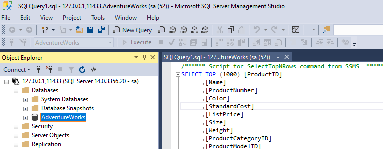

## 💻 SQL made ease with Docker
As a **developer** your primary job is solving problems by writing code and not dealing with tool like SQL SERVER, ... in alternative, you must automate the processes to deal with that tools and make it so sample as possible. This way you make sure that focus on programing.  
<h1 align="center">
    
</h1>

### 🧠🧘🏿‍ How to build image
```
docker build -t restore-db:latest .
```
### How to detach the container
```
docker run -p 11433:1433 -d restore-db:latest 
```
> **11433** - is the mapped port where SQL Server will be responding and
> **1433** - defalut sql server port
### How to stop and remove the container
```
docker stop ID1
```
```
docker rm ID1
```
> **ID1** - first 3 characters of the given id to the container 
### How to remove the image
```
docker rmi restore-db:latest
```
